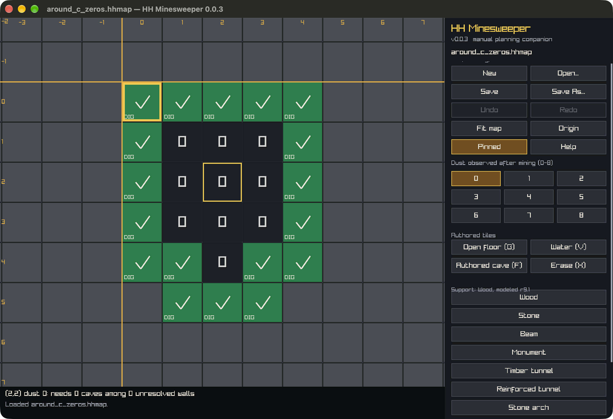
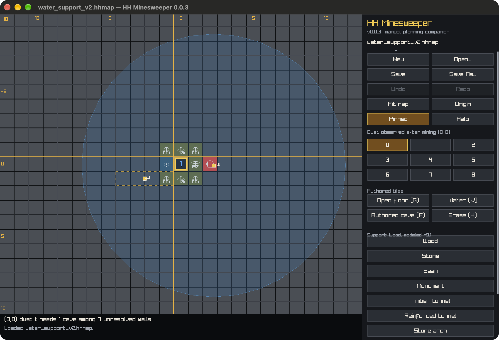
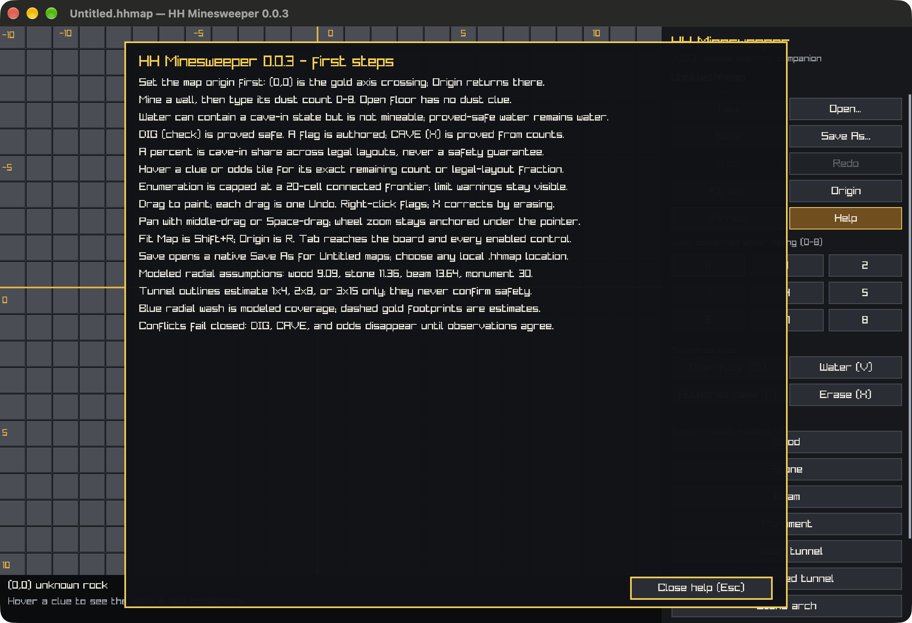

# HH Minesweeper

HH Minesweeper is a small C99 and raylib companion window for recording cave-in information while mining in [Haven & Hearth](https://www.havenandhearth.com/). You enter observations manually; the board identifies walls that are logically safe, walls that must contain a cave-in, and exact local legal-layout shares for unresolved walls.

The program does not connect to, inspect, or control the Haven & Hearth client.

## Interface tour

### Read deductions at a glance



Green checks and **DIG** labels are logical proofs, not guesses. Entered dust clues stay dark with their number, the gold outline marks the active cursor, and the status area explains the hovered clue in plain language.

### Plan around water and supports



Water keeps its wave mark because it is not mineable, but it still participates in cave-in constraints. Percentages are exact shares of legal local layouts. Blue radial coverage is modeled support protection; dashed gold tunnel footprints are estimates and never create a safety proof.

<details>
<summary><strong>First-run guide</strong></summary>



The same guide is always available from **Help**, `H`, or `/`.

</details>


## How mining dust works

After mining a tile, the dust you receive counts cave-ins in its eight neighboring tiles, including diagonals:

- `0.01 kg` means one adjacent cave-in, `0.02 kg` means two, and so on through `0.08 kg`.
- A count of `0` means that you mined the tile and no dust fell. Its eight neighbors are therefore safe.
- A cave-in tile does not produce a dust count of its own.

Enter the digit from `0` through `8`, not the dust weight. The board recalculates after every completed edit or painted stroke.

## First session

1. Start HH Minesweeper beside the game. Tile `(0,0)` has a gold outline; choose one consistent in-game tile to represent it.
2. Mine a tile and collect its dust. Hover the matching board square and press `0` through `8`, or select a dust button and paint.
3. Mark Natural Gallery floor that did not produce dust as **Open floor** (`G`). Never enter `0` on a room you did not mine.
4. Mark water with **Water** (`V`). Water may hold a cave-in state and affect shoreline clues, but the app never labels water **DIG**.
5. Read the board: **DIG** is proved safe, **CAVE** is proved from counts, a flag is authored by you, and a percent is the share of legal local layouts containing a cave-in. It is not a safety guarantee.
6. Hover a clue to see the unresolved walls it still constrains. Hover an odds tile to see its exact model fraction in the status area.
7. Use Undo or Redo to correct a gesture. Each painted stroke is one history step.

Contradictory observations fail closed: all derived **DIG**, **CAVE**, and percentage output is hidden until the counts agree. Conflicting observations remain visible for correction.

## Board states

| Board mark | Meaning |
|---|---|
| Check and **DIG** | Proved safe rock wall |
| X and **CAVE** | Cave-in proved from entered counts |
| Flag | Cave-in authored by you |
| Ringed cave | Cave-in inside modeled radial support coverage; mining it still damages support |
| `N%` / circle | Cave-in in that share of legal local layouts; not proved |
| Number `0`–`8` | A tile you mined and entered as a dust clue |
| Ring / `open` | Open floor with no dust clue |
| Waves | Water; not mineable, but still a cave-in candidate |
| Magenta hatch | Conflicting observation |
| Blue wash | Modeled radial support coverage |
| Dashed gold footprint | Directional tunnel estimate only; never used as safety proof |

Unresolved values never display literal `0%` or `100%`. Very small and very large unresolved shares display `<1%` and `>99%`; exact certainty uses **DIG** or **CAVE**.

## Supports

Radial support placement accepts sub-tile positions and uses these modeled radii:

| Support | Modeled radius |
|---|---:|
| Wood support | `100 / 11` tiles (`9.09`) |
| Stone column | `125 / 11` tiles (`11.36`) |
| Mine beam | `150 / 11` tiles (`13.64`) |
| Monumental column | `30` tiles |

The model tests coverage against tile centers. These values are planning assumptions; verify the current in-game support display at boundary tiles.

Timber Tunnel, Reinforced Tunnel, and Stone Arch Tunnel are available as centered, rotatable visual estimates of `1x4`, `2x8`, and `3x15`. Their authoritative server anchor and boundary rules are not published, so they do **not** classify a cave as protected. The status area reports confirmed radial overlap separately from estimated tunnel overlap.

Removing a support marker warns when known cave-in tiles would lose modeled radial coverage. This is a planning warning, not a prediction of the game's support-history and damage rules.

## Controls

| Input | Action |
|---|---|
| Hover/cursor + `0`–`8` | Enter the mined tile's dust count |
| `G` | Mark Open floor |
| `V` | Mark Water |
| `F` or right-click | Toggle an authored cave flag while preserving water terrain |
| `X` or Backspace | Erase all authored state at the tile |
| Left-click or left-drag | Apply the selected tile tool; one drag is one Undo |
| Shift-click | Place the selected support at the exact pointer position |
| `[` / `]` | Select previous or next support type |
| `,` / `.` | Rotate the selected directional support |
| Middle-drag or Space + left-drag | Pan |
| Mouse wheel | Zoom around the pointer |
| Tab / Shift-Tab | Move focus between the board and enabled controls |
| Arrow keys with board focus | Move the persistent board cursor |
| Shift + arrow keys | Pan the board |
| `W`, `A`, `D` | Pan up, left, or right |
| `U` or Ctrl/Cmd+Z | Undo one gesture |
| `Y` or Ctrl/Cmd+Shift+Z | Redo one gesture |
| `S` or Ctrl/Cmd+S | Save; untitled maps open Save As |
| Ctrl/Cmd+O or `L` | Open a map |
| Ctrl/Cmd+N or `N` | New map |
| `R` | Return to the origin |
| Shift+R | Fit authored map content |
| Ctrl/Cmd `+` / `-` | Change interface scale |
| `T` | Toggle always-on-top |
| `H` or `/` | Show help |

`.hhmap` files can also be dropped onto the window. The native title shows the full Unicode filename and modified state; the sidebar falls back to the title when its built-in font lacks those glyphs.

## Files and recovery

Version 0.0.3 writes strict version-2 `.hhmap` files containing authored tiles, terrain, continuous support positions, orientation, and viewport. Version-1 maps from earlier releases still load and are framed automatically.

Saving writes and durably flushes a temporary sibling file before replacing the destination. A failed save keeps the previous file and leaves the document modified. New, Open, and window close share a **Save / Discard / Cancel** guard. New documents are untitled and cannot overwrite the prior map without Save As.

The viewport is part of the saved document, so pan, zoom, Fit Map, Origin, and interface-scale changes mark the document modified.

## Explicit limits

The board uses sparse signed coordinates rather than a fixed rectangle, but it is not unlimited:

- authored tiles: `8192`;
- supports: `256`;
- coordinate range: `-1,000,000` through `1,000,000`;
- exact enumeration: `20` cells per connected frontier.

The app reports capacity and enumeration limits instead of presenting cutoff output as complete. Simple and subset proofs may still be available when exact odds exceed the frontier limit.

## Download a release

Tagged releases publish versioned bundles and SHA-256 checksums:

- `hhms-0.0.3-macos-universal.zip` — unsigned macOS 11+ universal `.app`;
- `hhms-0.0.3-windows-x64.zip`;
- `hhms-0.0.3-linux-x64.tar.gz`.

Each bundle includes the app, README, license, changelog, and example maps. The macOS bundle is unsigned; use Finder's **Open** command if Gatekeeper asks for confirmation.
The Linux binary uses the host's GTK3, X11, OpenGL, and audio libraries.


The executable also accepts a map path and a version query:

```sh
hhms path/to/mine.hhmap
hhms --version
```

## Build from source

GUI builds require Git, CMake 3.16 or newer, a C99 compiler, a C++ compiler for the native file-dialog backend, and platform GUI development libraries. CMake downloads content-locked raylib 5.5 and Native File Dialog Extended on the first GUI configuration.

```sh
make
./build/hhms
```

Core and headless application tests use a separate GUI-disabled build and do not download GUI dependencies:

```sh
make test
```

Run AddressSanitizer and UndefinedBehaviorSanitizer where supported:

```sh
make test-sanitize
```

## Project

Release notes are in [CHANGELOG.md](CHANGELOG.md). Contributions are described in [CONTRIBUTING.md](CONTRIBUTING.md). HH Minesweeper is maintained by [Collinw24](https://github.com/Collinw24) and released under the [MIT License](LICENSE).
